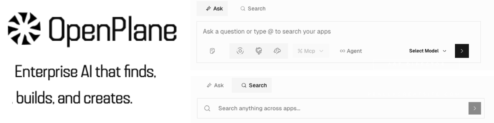

<div align="center">

[](https://github.com/kuluruvineeth/openplane)

[](https://www.typescriptlang.org/)
[](https://nextjs.org/)
[](https://hono.dev/)
[](https://bun.sh/)

**Enterprise search and AI assistant platform — open source alternative to Glean**

</div>

## Tech Stack

| Layer | Technology |
|-------|------------|
| **Monorepo** | Turborepo + Bun |
| **Language** | TypeScript, Python |
| **Frontend** | Next.js 16, React 19, TailwindCSS 4 |
| **Backend** | Hono, tRPC 11 |
| **Database** | PostgreSQL + Prisma |
| **Search** | Vespa |
| **Queue** | Temporal |
| **Cache** | Redis |
| **Storage** | S3/MinIO |
| **AI** | Vercel AI SDK |
| **Auth** | Better-Auth |

## Quick Start

```bash
make setup    # Install deps, start infra, setup database
make apps     # Start all apps with hot reload
```

Open http://localhost:3001

## Project Structure

```
apps/
├── web/        # Next.js frontend (:3001)
├── server/     # Hono API server (:3000)
├── worker/     # Temporal workers
├── engine/     # Python ML service (:8000)
└── docs/       # Documentation (:4000)

packages/
├── temporal/     # Workflows & activities
├── services/     # Connector business logic
├── db/           # Prisma schema
├── api/          # tRPC routers
├── ai/           # AI tools & agents
├── vespa/        # Search client
├── redis/        # Cache utilities
├── auth/         # Authentication
├── integrations/ # OAuth configs
├── types/        # Shared types
├── storage/      # S3 client
└── ui/           # Shared components
```

## Development

| Command | Description |
|---------|-------------|
| `make setup` | First-time setup |
| `make dev` | Start infrastructure |
| `make apps` | Start all apps |
| `make status` | Show service status |
| `make down` | Stop infrastructure |

| Command | Description |
|---------|-------------|
| `make db-push` | Push schema changes |
| `make db-studio` | Open Prisma Studio |
| `make db-reset` | Reset database |

| Command | Description |
|---------|-------------|
| `bun run check` | Lint & format |
| `bun run build` | Build all |
| `bun test` | Run tests |

See [DEVELOPMENT.md](./DEVELOPMENT.md) for detailed setup guide.

## Services

| Service | URL |
|---------|-----|
| Web | http://localhost:3001 |
| Server | http://localhost:3000 |
| Temporal UI | http://localhost:8233 |
| MinIO Console | http://localhost:9001 |
| Grafana | http://localhost:3002 |
| Jaeger | http://localhost:16686 |

## Docker

**All-in-Docker development:**
```bash
docker compose -f docker-compose.infra.yml -f docker-compose.dev.yml up --watch
```

**Production:**
```bash
docker compose -f docker-compose.infra.yml -f docker-compose.yml up -d
```

## Contributing

See [CONTRIBUTING.md](./CONTRIBUTING.md) for guidelines.

---

<div align="center">

Built with care by the OpenPlane team

</div>
