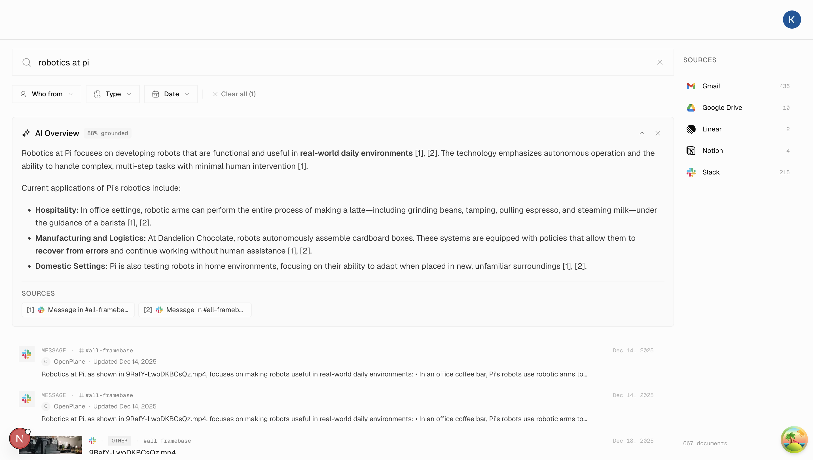

<div align="center">

<a href="https://openbeam.work">
  
</a>

<h3>OpenBeam</h3>

<p>The open source Glean alternative for the physical world</p>

<a href="https://openbeam.work">Website</a> · <a href="https://docs.openbeam.work">Docs</a> · <a href="https://github.com/kuluruvineeth/openbeam/issues">Issues</a>

<br />

[](https://github.com/kuluruvineeth/openbeam)
[](https://www.gnu.org/licenses/agpl-3.0)
[](https://github.com/kuluruvineeth/openbeam/commits/dev)
[](https://github.com/kuluruvineeth/openbeam/graphs/contributors)

</div>

<br />

<div align="center">
  
</div>

<br />

Enterprise knowledge is trapped in silos. Digital tools (Slack, GitHub, Notion, Gmail) don't talk to physical systems (IoT sensors, industrial protocols, camera feeds). **OpenBeam unifies both into one searchable, agent-ready layer.** One query across sensors and SaaS. Answers in 200ms. Runs on your servers.

Glean proved the digital half at a $7.2B valuation. Nobody has built the physical half. We're building both.

## Features

- **Unified Search** — Hybrid semantic + keyword search across all connected sources, sub-200ms p99 latency
- **AI Agents** — Tool-use agents that search, analyze, and act across your entire knowledge base with 100+ composable tools
- **Physical + Digital** — The only platform bridging SaaS tools and physical operations data in one query
- **25+ Connectors** — Gmail, Slack, GitHub, Google Drive, Notion, Linear, MQTT, OPC-UA, BACnet, AWS IoT, and growing
- **RAG Pipeline** — Grounded AI answers with citation and source attribution
- **Real-time Sync** — Webhooks and incremental sync keep your index fresh
- **Permission-Aware** — Respects source permissions — users only see what they have access to
- **Self-Hostable** — Deploy on your infrastructure with Docker Compose. Your data never leaves your servers
- **Edge Ready** — Offline-capable edge deployment with SQLite, local search, and sync protocol

## Connectors

<table>
<tr>
<td width="25%">

**Digital Knowledge**
- Google Drive
- Gmail
- Notion
- Linear
- Slack
- GitHub

</td>
<td width="25%">

**IoT Platforms**
- AWS IoT Core
- Azure IoT Hub
- SmartThings
- Samsara
- Verkada

</td>
<td width="25%">

**Industrial Protocols**
- MQTT
- OPC-UA
- BACnet
- ThingsBoard
- Node-RED

</td>
<td width="25%">

**Coming Soon**
- Jira
- Confluence
- Microsoft 365
- Salesforce
- Matterport
- FHIR (Healthcare)

</td>
</tr>
</table>

## Quick Start

```bash
git clone https://github.com/kuluruvineeth/openbeam.git
cd openbeam
make setup    # Install deps, start infra, setup database
make apps     # Start all apps with hot reload
```

Open [http://localhost:3001](http://localhost:3001) and you're in.

### Self-Hosting with Docker

```bash
docker compose -f docker-compose.infra.yml -f docker-compose.yml up -d
```

See the [Self-Hosting Guide](https://docs.openbeam.work/docs/self-hosting) for configuration, TLS, monitoring, and scaling.

## Tech Stack

| Layer | Technology |
|-------|------------|
| **Monorepo** | Turborepo + Bun workspaces |
| **Frontend** | Next.js 16, React 19, TailwindCSS 4, shadcn/ui |
| **Backend** | Hono, tRPC 11, Temporal |
| **Database** | PostgreSQL + Prisma |
| **Search** | Vespa (hybrid: BM25 + HNSW vectors) |
| **AI** | Vercel AI SDK, tool-use agents, MCP |
| **ML Engine** | Python (FastAPI), CPU + GPU services |
| **IoT Gateway** | MQTT, OPC-UA, BACnet protocol adapters |
| **Cache/Queue** | Redis |
| **Storage** | S3 / MinIO |
| **Auth** | Better Auth |
| **CLI** | Go 1.24, Cobra |
| **Mobile** | React Native (Expo) |
| **Desktop** | Tauri |
| **Observability** | Prometheus, Grafana, Loki |

## Architecture

```
apps/
├── web/          # Next.js frontend           (:3001)
├── server/       # Hono API server            (:3000)
├── worker/       # Temporal workers
├── engine/       # Python ML service          (:8000 CPU, :8001 GPU)
├── daemon/       # Local agent orchestration daemon
├── cli/          # Go CLI (openbeam command)
├── gateway/      # IoT protocol gateway
├── docs/         # Documentation site         (:4000)
├── website/      # Marketing site             (:3002)
├── mobile/       # React Native (Expo)
├── desktop/      # Tauri desktop app
├── voice/        # Voice pipeline (STT/TTS)
└── extension/    # Browser extension

packages/
├── ai/           # AI tools, agents, RAG engine
├── api/          # tRPC routers
├── auth/         # Authentication
├── db/           # Prisma schema & queries
├── integrations/ # OAuth configs, app registry
├── services/     # Connector business logic
├── temporal/     # Workflows & activities
├── types/        # Shared TypeScript types
├── vespa/        # Vespa search client
├── redis/        # Redis utilities
├── storage/      # S3/R2 client
├── ui/           # Shared UI components
└── edge-*/       # Edge deployment (core, search, AI)
```

## Development

```bash
make setup        # First-time setup (deps, infra, database)
make dev          # Start infrastructure services
make apps         # Start all apps with hot reload
make status       # Show service health
make down         # Stop infrastructure

bun run check     # Lint & format (Biome)
bun run build     # Build all packages
bun test          # Run tests
```

| Service | Local URL |
|---------|-----------|
| Web App | [localhost:3001](http://localhost:3001) |
| API Server | [localhost:3000](http://localhost:3000) |
| Docs | [localhost:4000](http://localhost:4000) |
| Temporal UI | [localhost:8233](http://localhost:8233) |
| Grafana | [localhost:3002](http://localhost:3002) |
| MinIO Console | [localhost:9001](http://localhost:9001) |

## Roadmap

- [x] Hybrid search (semantic + keyword, sub-200ms)
- [x] 25+ connectors (SaaS, IoT, industrial protocols)
- [x] AI agents with 100+ composable tools
- [x] RAG with grounded citations
- [x] Real-time sync via webhooks
- [x] Permission-aware search
- [x] Go CLI with MCP server
- [x] IoT protocol gateway (MQTT, OPC-UA, BACnet)
- [x] Edge deployment (offline SQLite, local search)
- [x] Voice pipeline (STT/TTS)
- [ ] Matterport spatial connector
- [ ] FHIR healthcare connector
- [ ] Microsoft 365 (Outlook, Teams, OneDrive, SharePoint)
- [ ] Salesforce connector
- [ ] Robotics knowledge API (REST + gRPC)
- [ ] Multi-tenant SaaS mode
- [ ] Fine-tuned embedding models
- [ ] Mobile app (iOS/Android) — in progress
- [ ] Desktop app (macOS/Windows/Linux) — in progress

## Why Open Source?

Enterprise search touches your most sensitive data — every message, document, sensor reading, and credential. You should be able to read every line of code that processes it.

AGPL-3.0 licensed. Self-host it, audit it, extend it. No vendor lock-in. No data leaving your network.

## Contributing

We welcome contributions. See [CONTRIBUTING.md](./CONTRIBUTING.md) for guidelines.

```bash
git clone https://github.com/YOUR_USERNAME/openbeam.git
cd openbeam
make setup && make apps
```

Check the [`good first issue`](https://github.com/kuluruvineeth/openbeam/labels/good%20first%20issue) label to get started.

## License

[GNU Affero General Public License v3.0 (AGPL-3.0)](./LICENSE)

---

<div align="center">

<strong>Built by <a href="https://github.com/kuluruvineeth">@kuluruvineeth</a></strong>

<a href="https://openbeam.work">Website</a> · <a href="https://docs.openbeam.work">Docs</a> · <a href="https://openbeam.work/pitch">Pitch Deck</a> · <a href="https://cal.com/kuluruvineeth/30min">Book a Demo</a>

</div>
