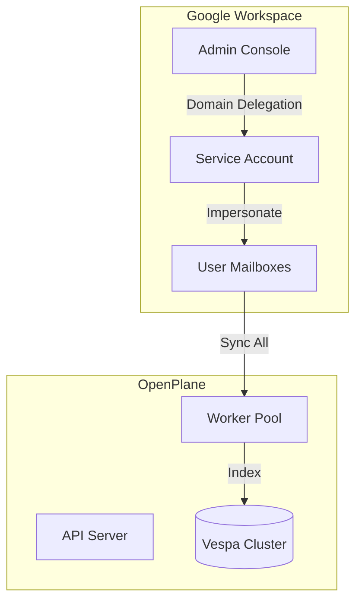
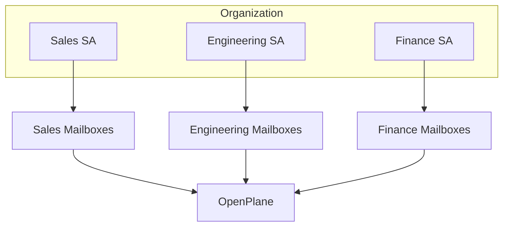

# Enterprise Deployment

Deploy the Gmail connector across your organization with Google Workspace integration, domain-wide access, and enterprise security controls.

## Google Workspace Integration

### Overview

For organizations using Google Workspace:

| Deployment Model | Access Scope | Setup Complexity |
|------------------|--------------|------------------|
| Per-user OAuth | Individual mailboxes | Simple |
| Domain-wide delegation | All mailboxes | Moderate |
| Service account | Specific mailboxes | Moderate |

### Architecture



## Domain-Wide Delegation

Access all mailboxes in your domain without individual user consent.

### Prerequisites

- Google Workspace Super Admin access
- Service account in Google Cloud Console
- Domain verification

### Step 1: Create Service Account

1. Go to [Google Cloud Console](https://console.cloud.google.com/iam-admin/serviceaccounts)
2. Click **+ CREATE SERVICE ACCOUNT**
3. Configure:
   - **Name**: `openplane-gmail`
   - **ID**: `openplane-gmail`
   - **Description**: "OpenPlane Gmail Integration"
4. Click **CREATE AND CONTINUE**
5. Skip optional steps → **DONE**

### Step 2: Create Service Account Key

1. Click on the service account
2. Go to **KEYS** tab
3. Click **ADD KEY → Create new key**
4. Select **JSON**
5. Download and secure the key file

<Callout type="warn">
  Store the service account key securely. It provides access to all delegated mailboxes.
</Callout>

### Step 3: Enable Domain-Wide Delegation

1. In service account details, click **SHOW ADVANCED SETTINGS**
2. Enable **Domain-wide Delegation**
3. Note the **Client ID** (numeric)

### Step 4: Authorize in Workspace Admin

1. Go to [Google Workspace Admin Console](https://admin.google.com)
2. Navigate to **Security → API Controls → Domain-wide Delegation**
3. Click **Add new**
4. Enter:
   - **Client ID**: From service account
   - **OAuth Scopes**:
     ```
     https://www.googleapis.com/auth/gmail.readonly,https://www.googleapis.com/auth/userinfo.email,https://www.googleapis.com/auth/userinfo.profile
     ```
5. Click **Authorize**

### Step 5: Configure OpenPlane

```bash
# Environment variables
GOOGLE_SERVICE_ACCOUNT_EMAIL=openplane-gmail@your-project.iam.gserviceaccount.com
GOOGLE_SERVICE_ACCOUNT_KEY_PATH=/path/to/service-account-key.json
GOOGLE_WORKSPACE_DOMAIN=your-company.com
```

## Multi-User Deployment

### Per-User OAuth

Each user authorizes individually:

| Pros | Cons |
|------|------|
| No admin setup | User action required |
| Granular consent | More OAuth flows |
| User awareness | Manual onboarding |

**Best for:** Smaller teams, user privacy focus

### Batch User Import

Import multiple users via admin:

1. Go to **Admin → Users**
2. Click **Import Users**
3. Upload CSV with email addresses
4. Initiate OAuth flow per user

### Service Account per Department

Segment access by organizational unit:



## Access Controls

### Role-Based Access

| Role | Permissions |
|------|-------------|
| **Admin** | Manage connectors, view all |
| **User** | Search own authorized data |
| **Viewer** | Search shared/public data only |

### Content Filtering

Control what's searchable:

| Filter | Description |
|--------|-------------|
| Label restrictions | Only specific labels indexed |
| Department scope | OUs mapped to access groups |
| Date limits | Retention policy compliance |
| Sensitive labels | Exclude confidential |

### Audit Logging

Track all access:

```json
{
  "timestamp": "2024-01-15T10:30:00Z",
  "action": "search",
  "user": "john@company.com",
  "query": "quarterly report",
  "results_count": 25,
  "connectors": ["gmail:jane@company.com"]
}
```

## Compliance & Security

### Data Residency

Configure where data is processed:

| Component | Location Control |
|-----------|-----------------|
| Sync workers | Deploy to specific regions |
| Search index | Vespa cluster location |
| Cache | Redis deployment region |

### Encryption

| Data State | Encryption |
|------------|------------|
| In transit | TLS 1.3 |
| At rest | AES-256 |
| Tokens | Encrypted storage |

### Retention Policies

Configure data retention:

```json
{
  "retentionDays": 365,
  "deleteOnDisconnect": true,
  "hardDeleteDelay": 30
}
```

### GDPR Compliance

| Requirement | Implementation |
|-------------|----------------|
| Right to access | Export user data |
| Right to deletion | Purge endpoint |
| Consent | OAuth flow consent |
| Data minimization | Configurable scope |

## Scaling Considerations

### Large Mailbox Handling

For mailboxes with 100k+ emails:

| Challenge | Solution |
|-----------|----------|
| Initial sync time | Parallel processing |
| Memory usage | Streaming fetch |
| Rate limits | Distributed workers |
| Index size | Vespa scaling |

### Worker Scaling

Horizontal scaling for sync workers:

```yaml
# Kubernetes example
apiVersion: apps/v1
kind: Deployment
metadata:
  name: gmail-workers
spec:
  replicas: 5
  selector:
    matchLabels:
      app: gmail-worker
  template:
    spec:
      containers:
      - name: worker
        resources:
          requests:
            memory: "512Mi"
            cpu: "250m"
          limits:
            memory: "1Gi"
            cpu: "500m"
```

### Quota Management

Monitor and manage API quotas:

| Quota | Workspace Limit | Monitoring |
|-------|-----------------|------------|
| Per-user daily | 250,000 | Dashboard alerts |
| Per-project | 1,000,000,000 | Cloud Monitoring |
| Concurrent | 10 | Worker concurrency |

## Shared Mailboxes

Index shared/group mailboxes:

### Setup

1. Create service account with delegation
2. Grant access to shared mailbox
3. Configure connector with shared address

### Permissions

| User | Access |
|------|--------|
| Shared mailbox members | Full search |
| Delegated users | Full search |
| Others | No access |

## Migration

### From Other Systems

| Source | Migration Path |
|--------|----------------|
| Google Vault | Export → Import |
| Exchange | PST → Gmail → Sync |
| Other search | Parallel run → Cutover |

### Phased Rollout

1. **Pilot** - IT team, 10-20 users
2. **Early adopters** - Volunteers, 100 users
3. **Department rollout** - One team at a time
4. **Organization-wide** - All users

## Monitoring

### Key Metrics

| Metric | Alert Threshold |
|--------|-----------------|
| Sync latency | > 5 minutes |
| Error rate | > 1% |
| Quota usage | > 80% |
| Index freshness | > 1 hour |

### Dashboards

Track enterprise deployment:

- Active connectors count
- Total indexed emails
- Sync job status
- Error breakdown by type
- API quota usage

## Support

### Enterprise Support Channels

| Channel | Response Time |
|---------|---------------|
| Email | 24 hours |
| Slack | 4 hours |
| Phone | 1 hour (critical) |

### SLA

| Severity | Definition | Response | Resolution |
|----------|------------|----------|------------|
| Critical | Service down | 1 hour | 4 hours |
| High | Major feature broken | 4 hours | 24 hours |
| Medium | Minor issue | 24 hours | 72 hours |
| Low | Enhancement | 72 hours | Roadmap |

## Related Documentation

<Cards>
  <Card title="Setup Guide" href="/docs/connectors/gmail/setup" description="Basic setup" />
  <Card title="Configuration" href="/docs/connectors/gmail/configuration" description="Settings reference" />
  <Card title="Troubleshooting" href="/docs/connectors/gmail/troubleshooting" description="Common issues" />
</Cards>
