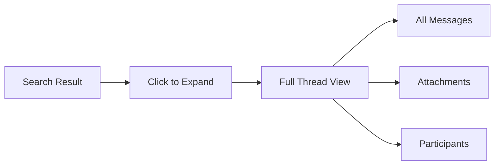

# Gmail Features

Discover everything you can do with the Gmail connector, from full-text search to AI-powered email assistance.

## Core Features

### Email Search

Search across all your emails with powerful full-text search:

- **Subject and body** - Find emails by any text content
- **Sender and recipient** - Search by email addresses
- **Date range** - Filter by when emails were sent/received
- **Attachments** - Find emails with specific attachment types

### Thread Grouping

Emails are indexed as conversations:

- Related messages grouped together
- Thread context preserved in search results
- View entire conversation from search
- Thread-level metadata (participants, dates)

### Attachment Indexing

Search inside email attachments:

| File Type | Extraction | OCR Support |
|-----------|------------|-------------|
| PDF | Full text | Yes |
| DOCX/DOC | Full text | - |
| XLSX/XLS | Cell content | - |
| PPTX/PPT | Slide text | - |
| TXT/CSV | Full content | - |
| Images | Filename + OCR | Yes |

### Label Filtering

Control what gets indexed by Gmail labels:

- **Include labels** - Only sync specific labels
- **Exclude labels** - Skip SPAM, TRASH, or custom labels
- **Automatic categorization** - Preserve Gmail categories in search

## Advanced Features

### Real-time Sync

With Pub/Sub enabled:

- New emails indexed within seconds
- Deletions reflected immediately
- Label changes synced in real-time
- No manual refresh needed

See [Pub/Sub Setup](/docs/connectors/gmail/pubsub-setup) to enable.

### Thread Preview

View email threads directly in search results:



Features include:
- Expandable message view
- Inline attachment previews
- Participant list with avatars
- Rich HTML email rendering
- Reply chain visualization

### Media Transcription

Audio and video attachments can be transcribed:

| Format | Transcription | Indexing |
|--------|---------------|----------|
| MP3/WAV | Yes | Full text |
| MP4/MOV | Yes | Full text |
| Voice memos | Yes | Full text |

<Callout type="info">
  Media transcription requires TwelveLabs integration. See configuration to enable.
</Callout>

### Federated Search

Search Gmail directly for real-time results:

- **Local index** - Fast, pre-indexed results
- **Gmail API** - Live results from Gmail
- **Hybrid mode** - Combine both sources

## Feature Comparison

| Feature | Basic | Pro | Enterprise |
|---------|:-----:|:---:|:----------:|
| Email indexing | ✓ | ✓ | ✓ |
| Thread grouping | ✓ | ✓ | ✓ |
| Attachment search | ✓ | ✓ | ✓ |
| Label filtering | ✓ | ✓ | ✓ |
| Real-time sync | - | ✓ | ✓ |
| Media transcription | - | ✓ | ✓ |
| Federated search | - | ✓ | ✓ |
| Thread preview | ✓ | ✓ | ✓ |
| Domain-wide access | - | - | ✓ |
| Shared mailboxes | - | - | ✓ |
| Audit logging | - | - | ✓ |

## Search Capabilities

### Search Operators

| Operator | Example | Description |
|----------|---------|-------------|
| Keyword | `quarterly report` | Match any word |
| Phrase | `"quarterly report"` | Exact phrase match |
| From | `from:john@company.com` | Sender filter |
| To | `to:team@company.com` | Recipient filter |
| Subject | `subject:meeting` | Subject line only |
| Has attachment | `has:attachment` | Emails with files |
| Date | `after:2024-01-01` | Date filtering |
| Label | `label:important` | Gmail label filter |

### Search Examples

```
# Find quarterly reports from finance team
from:finance@company.com quarterly report has:attachment

# Find meeting invites from last month
subject:meeting after:2024-01-01 before:2024-02-01

# Find emails with PDF attachments
has:attachment filetype:pdf

# Find important emails from specific person
from:ceo@company.com label:important
```

## AI Capabilities

### Semantic Search

Go beyond keyword matching:

- Understand intent and context
- Find conceptually related emails
- Handle synonyms and variations
- Rank by relevance, not just recency

### Question Answering

Ask natural language questions:

```
"What did John say about the Q4 budget?"
"When is the product launch scheduled?"
"Who approved the vendor contract?"
```

### Email Summarization

Get quick summaries:

- Thread summaries for long conversations
- Key points extraction
- Action item identification
- Participant contribution overview

## Integration Points

### Search Integration

Gmail results appear in unified search:

- Mixed with other connector results
- Ranked by relevance
- Filtered by source
- Grouped by conversation

### AI Assistant

Reference emails in AI conversations:

```
"Summarize my emails from last week about Project Alpha"
"Find the latest update from the engineering team"
"What decisions were made in the budget thread?"
```

## Limitations

| Limitation | Details |
|------------|---------|
| Read-only | Cannot send, delete, or modify emails |
| History depth | Default 1 year, configurable |
| Attachment size | 25MB max per attachment |
| Rate limits | Gmail API quotas apply |

## Related Documentation

<Cards>
  <Card title="Configuration" href="/docs/connectors/gmail/configuration" description="Customize features" />
  <Card title="Sync Behavior" href="/docs/connectors/gmail/sync" description="How syncing works" />
  <Card title="Setup Guide" href="/docs/connectors/gmail/setup" description="Get started" />
</Cards>
