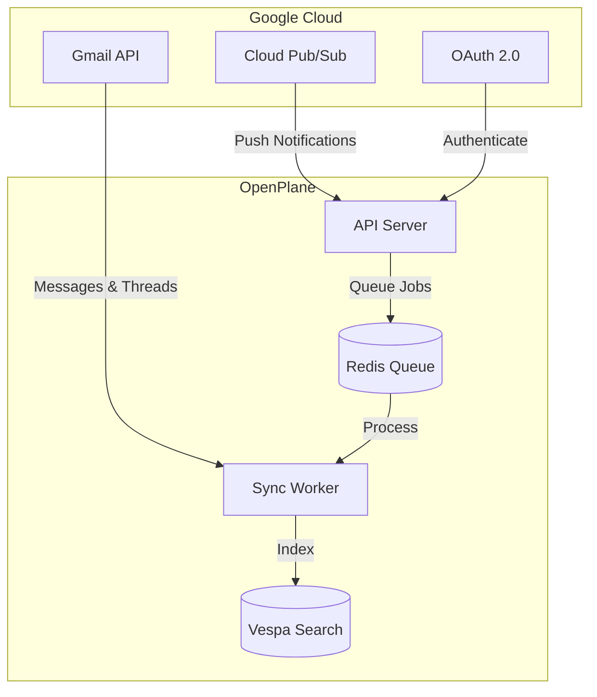

# Gmail Connector

Search emails, threads, and attachments across your Gmail. Real-time sync via Google Pub/Sub keeps your index always up-to-date.

<Cards>
  <Card title="Setup Guide" href="/docs/connectors/gmail/setup" />
  <Card title="Features" href="/docs/connectors/gmail/features" />
  <Card title="Configuration" href="/docs/connectors/gmail/configuration" />
  <Card title="Troubleshooting" href="/docs/connectors/gmail/troubleshooting" />
</Cards>

## Indexed Content

| Content Type | Indexed | Searchable | Preview |
|--------------|---------|------------|---------|
| Emails | Yes | Full-text | Yes |
| Threads | Yes | Grouped | Yes |
| Attachments | Yes | Extracted text | Yes |
| Labels | Yes | Filterable | - |

## Architecture

## Quick Start

1. **Create Google Cloud Project** - Set up OAuth credentials ([detailed guide](/docs/connectors/gmail/google-cloud-setup))
2. **Enable APIs** - Gmail API, People API, and optionally Pub/Sub API
3. **Configure OAuth** - Set redirect URIs and scopes
4. **Connect in OpenPlane** - Authorize access and start syncing

## Key Features

- **Full-text search** across all emails and threads
- **Attachment indexing** with text extraction (PDF, DOCX, etc.)
- **Real-time sync** via Google Pub/Sub push notifications
- **Thread preview** - view entire conversations in search results
- **Label filtering** - include or exclude specific Gmail labels
- **Media transcription** - audio/video attachment processing

<Cards>
  <Card title="Google Cloud Setup" href="/docs/connectors/gmail/google-cloud-setup" />
  <Card title="Pub/Sub Setup" href="/docs/connectors/gmail/pubsub-setup" />
  <Card title="Enterprise" href="/docs/connectors/gmail/enterprise" />
</Cards>
