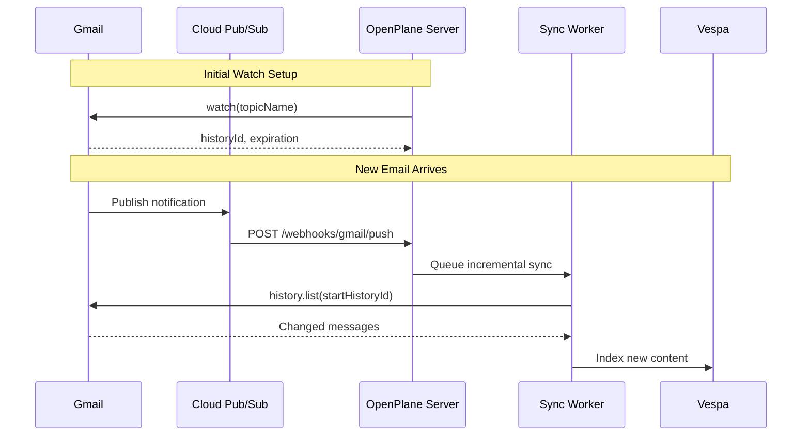

# Pub/Sub Setup

Enable real-time email sync using Google Cloud Pub/Sub. When new emails arrive, Gmail sends push notifications to OpenPlane for instant indexing.

## When to Use Pub/Sub

| Sync Method | Latency | Setup Complexity | Recommended For |
|-------------|---------|------------------|-----------------|
| **Polling** | 5-15 minutes | Simple | Development, small teams |
| **Pub/Sub** | Seconds | Moderate | Production, real-time needs |

<Callout type="info">
  Pub/Sub is optional. OpenPlane works without it using scheduled sync, but new emails take longer to appear in search.
</Callout>

## Architecture



## Prerequisites

Before configuring Pub/Sub:

- [ ] Cloud Pub/Sub API enabled in Google Cloud Console
- [ ] OpenPlane server accessible via HTTPS
- [ ] Valid SSL certificate on webhook endpoint

## Step 1: Create Pub/Sub Topic

1. Open [Google Cloud Console](https://console.cloud.google.com/cloudpubsub)
2. Navigate to **Pub/Sub → Topics**
3. Click **+ CREATE TOPIC**
4. Configure:
   - **Topic ID**: `gmail-notifications` (or your preferred name)
   - **Add a default subscription**: Uncheck (we'll create a push subscription)
5. Click **CREATE**

Note the full topic name:
```
projects/YOUR-PROJECT-ID/topics/gmail-notifications
```

## Step 2: Grant Gmail Permission

Gmail needs permission to publish to your topic:

1. Select your topic in the Pub/Sub console
2. Click **PERMISSIONS** tab
3. Click **+ GRANT ACCESS**
4. Configure:
   - **New principals**: `gmail-api-push@system.gserviceaccount.com`
   - **Role**: Pub/Sub Publisher
5. Click **SAVE**

<Callout type="warn">
  This step is critical. Without it, Gmail cannot send notifications to your topic.
</Callout>

## Step 3: Create Push Subscription

1. Click on your topic
2. Click **+ CREATE SUBSCRIPTION**
3. Configure:

| Setting | Value |
|---------|-------|
| Subscription ID | `gmail-push-subscription` |
| Delivery type | **Push** |
| Endpoint URL | `https://your-server.com/api/v1/webhooks/gmail/push` |
| Expiration | Never expire |
| Acknowledgment deadline | 60 seconds |
| Message retention | 7 days |

4. Click **CREATE**

## Step 4: Configure OpenPlane

When connecting Gmail in OpenPlane, enable real-time sync:

1. Go to **Settings → Connectors → Gmail**
2. Enable **Real-time sync**
3. Enter your Pub/Sub topic:
   ```
   projects/YOUR-PROJECT-ID/topics/gmail-notifications
   ```
4. Save configuration

## Webhook Endpoint

OpenPlane exposes a webhook endpoint for Pub/Sub:

| Endpoint | Method | Purpose |
|----------|--------|---------|
| `/api/v1/webhooks/gmail/push` | POST | Receive push notifications |
| `/api/v1/webhooks/gmail/health` | GET | Health check |

### Testing the Endpoint

Verify your webhook is accessible:

```bash
curl https://your-server.com/api/v1/webhooks/gmail/health
```

Expected response:
```json
{
  "status": "healthy",
  "timestamp": "2024-01-15T10:30:00Z"
}
```

## Watch Management

OpenPlane automatically manages Gmail watches:

### Watch Lifecycle

| Event | Action |
|-------|--------|
| Connector connected | Create initial watch |
| Watch expires (7 days) | Automatic renewal |
| Connector disconnected | Stop watch |
| Server restart | Restore watches |

### Manual Watch Refresh

If notifications stop working:

1. Go to connector settings
2. Click **Refresh Watch**
3. Verify notifications resume

## Testing Push Notifications

### Method 1: Send Test Email

1. Send an email to your connected Gmail account
2. Wait 10-30 seconds
3. Check OpenPlane logs for:
   ```
   Gmail push notification received
   Queuing incremental sync for connector: xxx
   ```

### Method 2: Pub/Sub Console

1. Go to your subscription in Cloud Console
2. Click **MESSAGES** tab
3. View received/acknowledged messages

### Method 3: gcloud CLI

```bash
# Publish test message
gcloud pubsub topics publish gmail-notifications \
  --message='{"emailAddress":"test@example.com","historyId":"12345"}'
```

## Notification Format

Gmail sends notifications in this format:

```json
{
  "message": {
    "data": "eyJlbWFpbEFkZHJlc3MiOiJ1c2VyQGV4YW1wbGUuY29tIiwiaGlzdG9yeUlkIjoiMTIzNDU2In0=",
    "messageId": "123456789",
    "publishTime": "2024-01-15T10:30:00.000Z"
  },
  "subscription": "projects/my-project/subscriptions/gmail-push-subscription"
}
```

The `data` field is base64-encoded JSON containing:
```json
{
  "emailAddress": "user@example.com",
  "historyId": "123456"
}
```

## Troubleshooting

### No Notifications Received

| Check | Solution |
|-------|----------|
| Topic permissions | Verify `gmail-api-push@system.gserviceaccount.com` has Publisher role |
| Subscription endpoint | Ensure URL is correct and accessible |
| SSL certificate | Must be valid (not self-signed) |
| Firewall | Allow incoming HTTPS from Google IPs |

### Duplicate Notifications

OpenPlane deduplicates notifications using history IDs. If you see duplicates:

1. Check for multiple subscriptions pointing to the same topic
2. Verify acknowledgment is working correctly

### Watch Expiration

Watches expire after 7 days. OpenPlane auto-renews, but if renewal fails:

1. Check OAuth token is still valid
2. Verify API quotas aren't exceeded
3. Manually refresh the watch

## Rate Limits

| Limit | Value | Notes |
|-------|-------|-------|
| Watch requests | 1 per user per day | OpenPlane handles renewal |
| Notifications | No limit | Volume depends on email activity |
| History list | 250 calls per user per second | Sufficient for most use cases |

## Security Considerations

- Webhook endpoint validates Pub/Sub message signatures
- HTTPS required for all webhook communication
- Notifications contain minimal data (email address + history ID)
- Actual email content fetched via authenticated API calls

## Related Documentation

<Cards>
  <Card title="Setup Guide" href="/docs/connectors/gmail/setup" description="Complete Gmail setup" />
  <Card title="Sync Behavior" href="/docs/connectors/gmail/sync" description="Understand sync lifecycle" />
  <Card title="Troubleshooting" href="/docs/connectors/gmail/troubleshooting" description="Common issues" />
</Cards>
