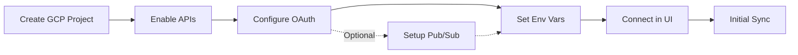

# Gmail Setup Guide

Connect your Gmail account to OpenPlane in minutes. This guide covers both basic setup and optional real-time sync configuration.

## Prerequisites

Before you begin, ensure you have:

- Google Cloud Console access (free tier works)
- OpenPlane instance running with HTTPS endpoint
- Admin access to configure connectors

## Setup Flow



## Step 1: Create Google Cloud Project

1. Go to [Google Cloud Console](https://console.cloud.google.com/)
2. Click **Select a project** → **New Project**
3. Enter project name (e.g., "OpenPlane Integration")
4. Click **Create**

<Callout type="info">
  You can use an existing project if you already have one configured for Google integrations.
</Callout>

## Step 2: Enable Required APIs

Navigate to **APIs & Services → Library** and enable:

| API | Purpose | Required |
|-----|---------|----------|
| Gmail API | Email access | Yes |
| People API | User profile info | Yes |
| Cloud Pub/Sub API | Real-time notifications | Optional |

## Step 3: Configure OAuth Consent Screen

1. Go to **APIs & Services → OAuth consent screen**
2. Select **External** (or **Internal** for Workspace)
3. Fill in required fields:
   - **App name**: Your app name
   - **User support email**: Your email
   - **Developer contact**: Your email
4. Click **Save and Continue**
5. Add scopes (see [OAuth Scopes](/docs/connectors/gmail/oauth-scopes))
6. Add test users (your Gmail addresses)
7. Complete the wizard

## Step 4: Create OAuth Credentials

1. Go to **APIs & Services → Credentials**
2. Click **+ CREATE CREDENTIALS → OAuth client ID**
3. Select **Web application**
4. Configure:
   - **Name**: "OpenPlane Gmail"
   - **Authorized redirect URIs**: Add your callback URL

```bash
# Redirect URI format
https://your-domain.com/connectors/setup/gmail/oauth/callback
```

5. Click **Create** and save the credentials

## Step 5: Configure Environment Variables

Add these to your server environment:

```bash
# Required
GOOGLE_CLIENT_ID=your-client-id.apps.googleusercontent.com
GOOGLE_CLIENT_SECRET=GOCSPX-your-secret

# Your domain URLs
WEB_URL=https://your-domain.com
SERVER_URL=https://api.your-domain.com
```

## Step 6: Connect in OpenPlane

1. Navigate to **Settings → Connectors**
2. Click **Add Connector → Gmail**
3. Click **Connect** to start OAuth flow
4. Authorize the requested permissions
5. Configure sync options:
   - Labels to include/exclude
   - Attachment indexing
   - Real-time sync (if Pub/Sub configured)

## Step 7: Verify Connection (Optional)

After connecting, verify:

1. **Connection Status**: Shows "Active" in connector list
2. **Initial Sync**: First sync starts automatically
3. **Test Search**: Search for a recent email to confirm indexing

## What's Next?

<Cards>
  <Card title="Google Cloud Setup" href="/docs/connectors/gmail/google-cloud-setup" description="Detailed GCP configuration guide" />
  <Card title="Pub/Sub Setup" href="/docs/connectors/gmail/pubsub-setup" description="Enable real-time sync" />
  <Card title="Configuration" href="/docs/connectors/gmail/configuration" description="Advanced settings" />
  <Card title="Troubleshooting" href="/docs/connectors/gmail/troubleshooting" description="Common issues and solutions" />
</Cards>
