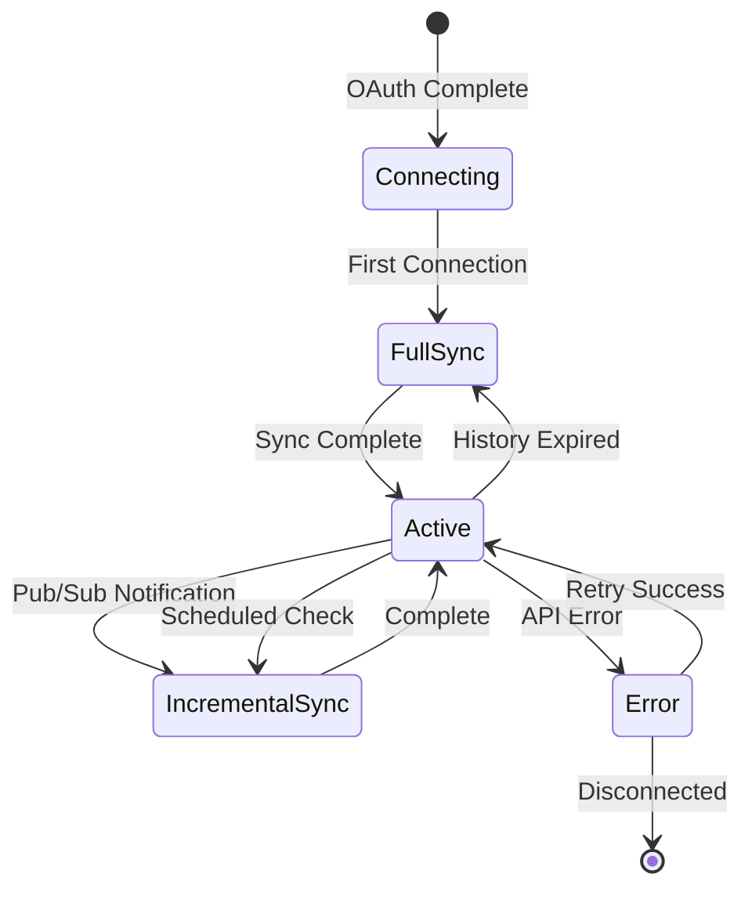
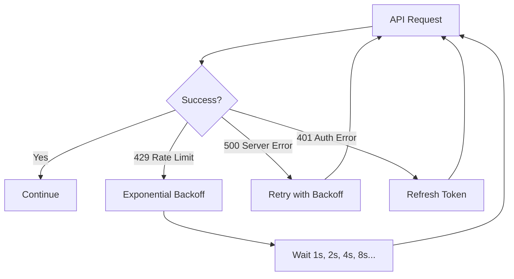

# Sync Behavior

Learn how OpenPlane syncs your Gmail data, from initial indexing to real-time updates.

## Sync Types

### Full Sync

Complete indexing of all emails within configured parameters:

- **When triggered**: First connection, manual resync, history expiration
- **Duration**: Minutes to hours depending on mailbox size
- **Resource usage**: High API calls, moderate memory

### Incremental Sync

Updates since last sync:

- **When triggered**: Scheduled interval, Pub/Sub notification
- **Duration**: Seconds to minutes
- **Resource usage**: Low API calls

### History-based Sync

Gmail's efficient change tracking:

- **When triggered**: Pub/Sub push notification
- **Duration**: Seconds
- **Resource usage**: Minimal API calls

## Sync Lifecycle



## Sync Process

### Initial Sync Flow

1. **Authentication** - Validate OAuth tokens
2. **Label discovery** - Fetch available Gmail labels
3. **Message enumeration** - List messages matching criteria
4. **Batch fetching** - Retrieve message content in batches
5. **Processing** - Extract text, metadata, attachments
6. **Indexing** - Store in search index
7. **Watch setup** - Configure Pub/Sub (if enabled)

### Incremental Sync Flow

1. **Get last history ID** - Retrieve sync cursor
2. **Fetch history** - Get changes since last sync
3. **Process changes** - Handle new, modified, deleted messages
4. **Update index** - Apply changes to search index
5. **Update cursor** - Store new history ID

## Status Indicators

| Status | Description | Action |
|--------|-------------|--------|
| **Connecting** | Validating credentials | Wait |
| **Syncing** | Active sync in progress | Wait |
| **Active** | Fully synced, watching for changes | None |
| **Error** | Sync failed | Check logs |
| **Paused** | Manually paused | Resume when ready |

## Rate Limits

Gmail API enforces quotas:

| Quota | Limit | Reset |
|-------|-------|-------|
| Queries per day | 1,000,000,000 | Daily |
| Queries per 100 seconds per user | 250 | Rolling |
| Concurrent requests | 10 | Immediate |

### Backoff Strategy

OpenPlane handles rate limits automatically:



## History ID Management

Gmail uses history IDs for efficient sync:

### How It Works

- Each change gets a unique history ID
- IDs are sequential and never reused
- OpenPlane stores the last processed ID
- Incremental sync fetches changes since that ID

### History Expiration

History IDs expire after approximately 7 days:

| Scenario | Detection | Response |
|----------|-----------|----------|
| Normal gap | History API succeeds | Incremental sync |
| Small gap (< 7 days) | History API succeeds | Incremental sync |
| Large gap (> 7 days) | `HISTORY_ID_EXPIRED` | Automatic full sync |

<Callout type="info">
  OpenPlane automatically falls back to full sync when history expires. No manual intervention needed.
</Callout>

## Watch Management

### Watch Lifecycle

| Event | Action | Duration |
|-------|--------|----------|
| Connector connected | Create watch | - |
| Watch active | Receive notifications | 7 days |
| Watch expiring | Auto-renew | - |
| Connector paused | Stop watch | - |
| Connector resumed | Recreate watch | - |

### Watch Renewal

Watches expire after 7 days. OpenPlane handles renewal:

1. Background job checks watch expiration
2. Renews 1 day before expiration
3. Falls back to polling if renewal fails

## Sync Statistics

Track sync progress in the UI:

| Metric | Description |
|--------|-------------|
| **Documents indexed** | Total emails in index |
| **Last sync** | Timestamp of last sync |
| **Sync duration** | Time taken for last sync |
| **Messages processed** | Count from last sync |
| **Errors** | Failed operations count |

## Performance Optimization

### Batch Processing

Messages are fetched in configurable batches:

| Setting | Default | Description |
|---------|---------|-------------|
| `batchSize` | 100 | Messages per API request |
| `concurrency` | 5 | Parallel batch requests |

### Attachment Handling

Large attachments are processed efficiently:

1. Metadata indexed immediately
2. Content extracted asynchronously
3. Large files streamed, not buffered
4. Failed extractions don't block sync

## Manual Sync Controls

### Trigger Full Resync

When you need a fresh start:

1. Go to **Settings → Connectors → Gmail**
2. Click **Actions → Full Resync**
3. Confirm the operation

### Pause Sync

Temporarily stop syncing:

1. Go to connector settings
2. Click **Pause**
3. Sync stops, data retained
4. Click **Resume** to continue

### Force Incremental

Trigger immediate incremental sync:

1. Go to connector settings
2. Click **Sync Now**
3. Incremental sync starts

## Monitoring

### Logs

Check sync logs for issues:

```bash
# Server logs
tail -f logs/server.log | grep gmail

# Worker logs
tail -f logs/worker.log | grep gmail
```

### Health Endpoints

| Endpoint | Purpose |
|----------|---------|
| `/api/health` | Overall service health |
| `/api/connectors/:id/status` | Connector-specific status |

## Troubleshooting Sync Issues

| Issue | Possible Cause | Solution |
|-------|----------------|----------|
| Sync stuck | Rate limit | Wait for reset |
| Old emails missing | Lookback too short | Increase lookback, resync |
| New emails delayed | Pub/Sub issue | Check webhook, refresh watch |
| Sync errors | Token expired | Reconnect connector |

## Related Documentation

<Cards>
  <Card title="Configuration" href="/docs/connectors/gmail/configuration" description="Sync settings" />
  <Card title="Pub/Sub Setup" href="/docs/connectors/gmail/pubsub-setup" description="Real-time sync" />
  <Card title="Troubleshooting" href="/docs/connectors/gmail/troubleshooting" description="Common issues" />
</Cards>
