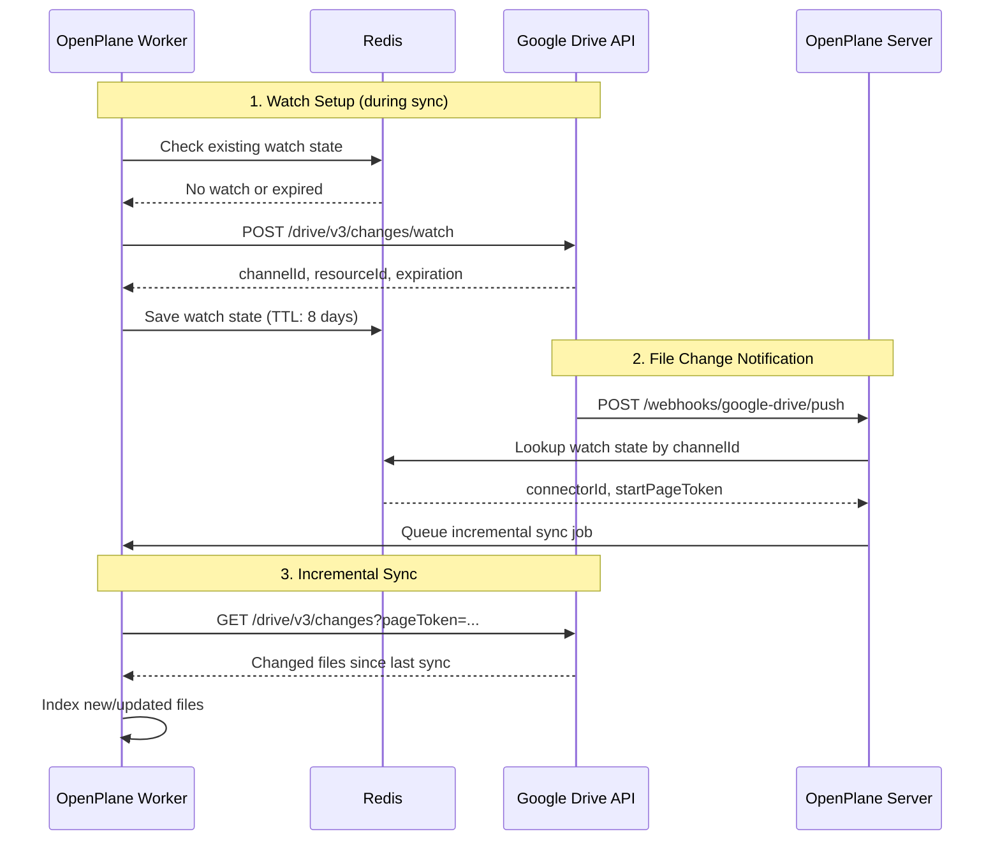
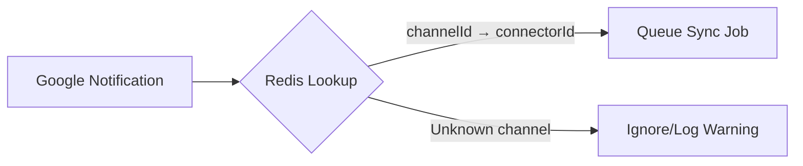
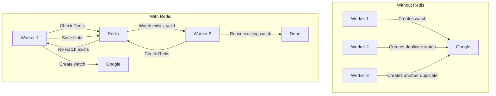
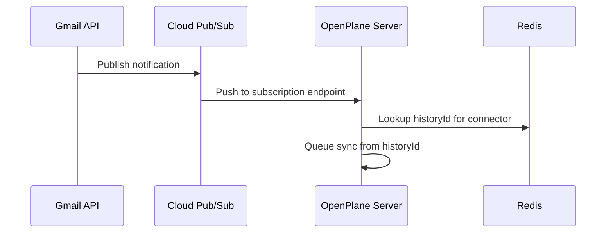
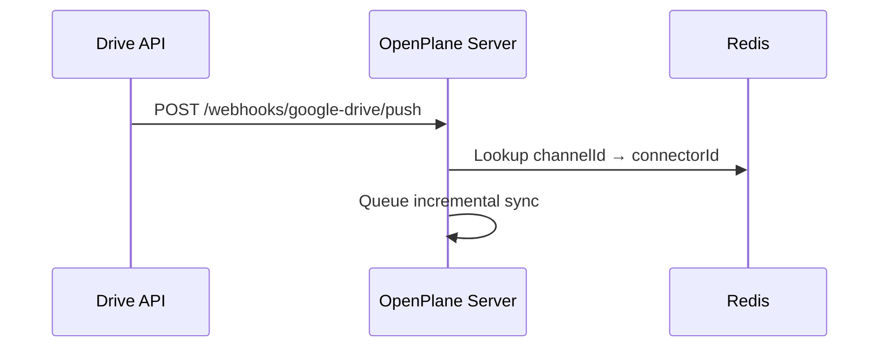
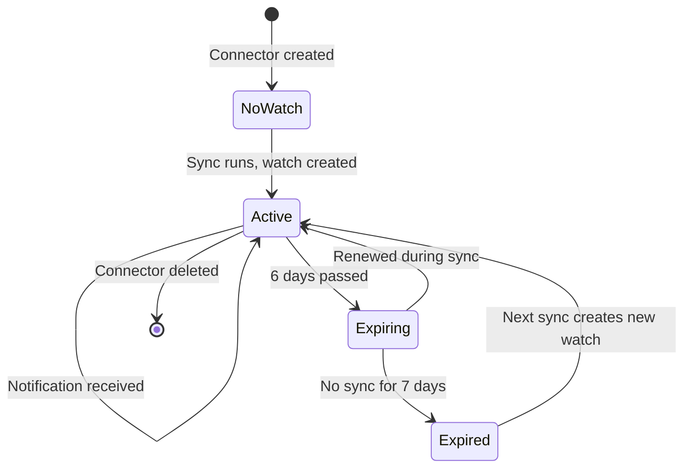

# Real-time Sync

Google Drive supports push notifications via webhooks. When files change, Google sends a POST request to your server, triggering an immediate incremental sync.

**Without Push**: Polling every 15 minutes
**With Push**: Instant notifications, seconds latency

## Architecture Overview



## Why Redis?

Redis serves as the **single source of truth** for watch state across distributed workers:

### 1. Watch State Persistence

When we create a watch with Google, we get back:
- `channelId` - Unique identifier for this watch channel
- `resourceId` - Google's internal resource identifier
- `expiration` - When the watch expires (max 7 days)
- `startPageToken` - Where to start fetching changes

This state MUST be persisted because:
- Workers are stateless and can restart anytime
- Multiple workers may handle the same connector
- Google doesn't store this mapping for us

```typescript
// Watch state stored in Redis
interface DriveWatchState {
  channelId: string;      // From Google
  resourceId: string;     // From Google
  expiration: number;     // Unix timestamp
  startPageToken: string; // For fetching changes
  connectorId: string;    // Our connector ID
  webhookUrl: string;     // Where Google sends notifications
}
```

### 2. Channel → Connector Mapping

When Google sends a push notification, it only includes:
```http
POST /webhooks/google-drive/push
X-Goog-Channel-ID: abc123
X-Goog-Resource-ID: xyz789
X-Goog-Resource-State: change
```

We need Redis to answer: **"Which connector does channel `abc123` belong to?"**



### 3. Expiration Tracking

Watches expire after 7 days. Redis helps us:
- Track when each watch expires
- Find watches needing renewal
- Prevent duplicate watch creation

```typescript
// Check if watch needs renewal (1 hour buffer)
const needsRenewal = Date.now() > expiration - (60 * 60 * 1000);
```

### 4. Distributed Coordination

Multiple workers might try to sync the same connector:



## Redis Key Structure

```text
gmail:watch:{connectorId}     → Gmail watch state
google-drive:watch:{connectorId} → Drive watch state
```

Each key has a TTL of 8 days (slightly longer than Google's 7-day watch expiration) to ensure cleanup.

## Gmail vs Google Drive

| Aspect | Gmail | Google Drive |
|--------|-------|--------------|
| Notification method | Cloud Pub/Sub | Direct webhook |
| Setup complexity | Higher (needs Pub/Sub) | Lower (just webhook URL) |
| Reliability | Higher (Pub/Sub retry) | Lower (single POST) |
| Watch expiration | 7 days | 7 days |
| Redis usage | Identical | Identical |

### Gmail Flow (Pub/Sub)



### Google Drive Flow (Direct Webhook)



## Setup Requirements

### Environment Variables

```bash
# Required for watch setup
SERVER_URL=https://your-server.com
```

The webhook URL is auto-generated: `${SERVER_URL}/webhooks/google-drive/push`

### Google Cloud Console

1. Your OAuth app must have access to the Drive API
2. The webhook URL must be HTTPS with valid SSL
3. The webhook endpoint must be publicly accessible

## Connector Configuration

In connector settings:

| Setting | Description | Default |
|---------|-------------|---------|
| Real-time Updates | Enable push notifications | `true` |

When enabled and `SERVER_URL` is configured, the watch is automatically set up during sync.

## Watch Lifecycle



## Troubleshooting

| Issue | Cause | Solution |
|-------|-------|----------|
| No notifications | `SERVER_URL` not set | Set `SERVER_URL` env var |
| Watch setup fails | URL not HTTPS | Use valid SSL certificate |
| Duplicate syncs | Multiple workers racing | Redis handles coordination |
| Watch expired | No sync for 7 days | Run manual sync to renew |
| Unknown channel | Redis data lost | Watch recreated on next sync |

## Monitoring

Check watch state via Redis:

```bash
# List all active watches
redis-cli KEYS "google-drive:watch:*"

# Get specific watch state
redis-cli GET "google-drive:watch:{connectorId}"
```

Log messages to look for:

```text
"Google Drive watch set up successfully"  # Watch created
"Google Drive push notification received"  # Notification arrived
"Google Drive sync queued from push notification"  # Sync triggered
```
