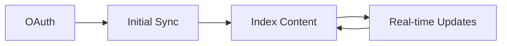

# Connectors

Integrate your tools for unified search and AI assistance.

## Available

<Cards>
  <Card title="Slack" href="/docs/connectors/slack" description="Messages, files, channels" />
  <Card title="Gmail" href="/docs/connectors/gmail" description="Emails, threads, attachments" />
</Cards>

## Coming Soon

<Cards>
  <Card title="Google Drive" href="/docs/connectors/google-drive" description="Docs, sheets, files" />
  <Card title="Notion" href="/docs/connectors/notion" description="Pages, databases" />
  <Card title="Linear" href="/docs/connectors/linear" description="Issues, projects" />
</Cards>

## How Connectors Work

| Phase | Description |
|-------|-------------|
| **OAuth** | Secure auth with minimal scopes |
| **Sync** | Full index of historical content |
| **Real-time** | Webhooks for instant updates |
| **Permissions** | Respects source access control |

## Sync Modes

| Mode | Trigger | Use Case |
|------|---------|----------|
| Full | Manual, first connect | Complete re-index |
| Incremental | Scheduled | New/modified content |
| Real-time | Webhook | Instant updates |
