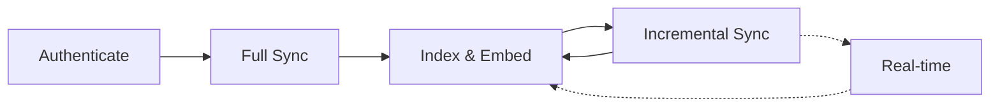

# Connectors

20+ connectors across SaaS, IoT, industrial protocols, and physical AI platforms.

## SaaS Connectors

<Cards>
  <Card title="Slack" href="/docs/connectors/slack" description="Messages, files, channels, threads" />
  <Card title="Gmail" href="/docs/connectors/gmail" description="Emails, threads, attachments" />
  <Card title="Google Drive" href="/docs/connectors/google-drive" description="Docs, sheets, slides, files" />
  <Card title="Notion" href="/docs/connectors/notion" description="Pages, databases, blocks" />
  <Card title="Linear" href="/docs/connectors/linear" description="Issues, projects, comments" />
  <Card title="GitHub" href="/docs/connectors/github" description="Repos, issues, PRs, code" />
</Cards>

## IoT Connectors

<Cards>
  <Card title="Samsara" href="/docs/connectors/samsara" description="Fleet, sensors, industrial IoT" />
  <Card title="AWS IoT" href="/docs/connectors/aws-iot" description="AWS IoT Core devices and telemetry" />
  <Card title="Azure IoT" href="/docs/connectors/azure-iot" description="Azure IoT Hub devices and twins" />
  <Card title="SmartThings" href="/docs/connectors/smartthings" description="Samsung SmartThings devices" />
  <Card title="Verkada" href="/docs/connectors/verkada" description="Cameras, sensors, access control" />
</Cards>

## Industrial Protocol Connectors

<Cards>
  <Card title="MQTT" href="/docs/connectors/mqtt" description="MQTT broker topics and messages" />
  <Card title="OPC-UA" href="/docs/connectors/opcua" description="OPC Unified Architecture nodes" />
  <Card title="BACnet" href="/docs/connectors/bacnet" description="Building automation devices" />
  <Card title="ThingsBoard" href="/docs/connectors/thingsboard" description="ThingsBoard platform entities" />
  <Card title="Node-RED" href="/docs/connectors/nodered" description="Node-RED flows and configurations" />
</Cards>

## Physical AI Connectors

<Cards>
  <Card title="FHIR" href="/docs/connectors/fhir" description="Healthcare data (HL7 FHIR R4)" />
  <Card title="Matterport" href="/docs/connectors/matterport" description="3D spatial scans and models" />
  <Card title="Omniverse" href="/docs/connectors/omniverse" description="NVIDIA Omniverse scenes and assets" />
  <Card title="Viam" href="/docs/connectors/viam" description="Robotics platforms and components" />
</Cards>

## How Connectors Work

| Phase | Description |
|-------|-------------|
| **Authenticate** | OAuth or API key with minimal required scopes |
| **Full Sync** | Complete index of historical content |
| **Index & Embed** | Parse, chunk, generate embeddings, store in Vespa |
| **Incremental Sync** | Scheduled sync of new and modified content |
| **Real-time** | Webhook-driven instant updates (connector-specific) |

## Sync Modes

| Mode | Trigger | Availability |
|------|---------|-------------|
| Full | First connect, manual re-index | All connectors |
| Incremental | Scheduled (configurable interval) | All connectors |
| Real-time | Webhooks | Slack, Gmail (Pub/Sub), Linear |

## Building a Connector

See the [Connector Development Guide](/docs/contributing/connectors) for instructions on adding new connectors.
