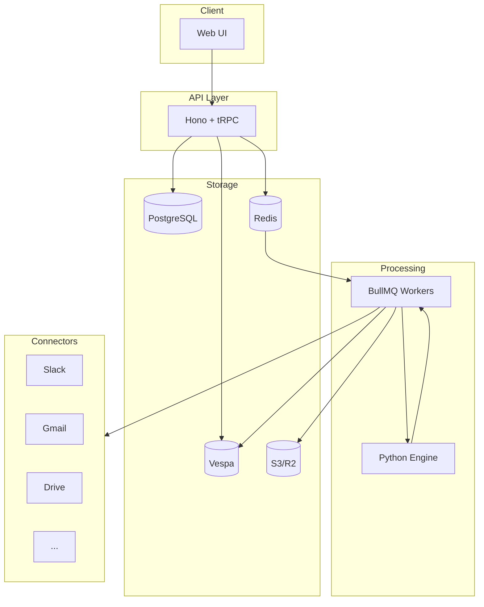
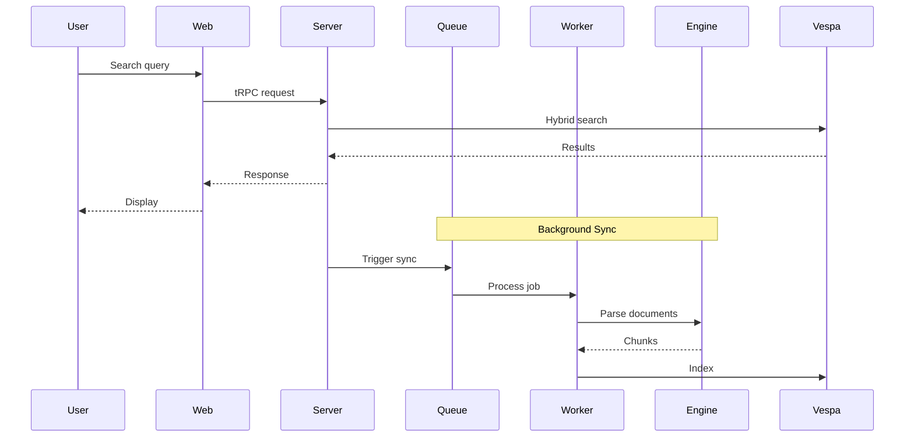

# OpenPlane

Open source enterprise search and AI assistant. Alternative to Glean.

## Architecture



## Stack

| Layer | Technology |
|-------|------------|
| Frontend | Next.js 16, React 19, TailwindCSS 4 |
| API | Hono, tRPC 11 |
| Workers | BullMQ |
| ML Engine | FastAPI, Unstructured |
| Search | Vespa |
| AI | Vercel AI SDK (Claude, GPT, Gemini) |
| Database | PostgreSQL, Prisma |
| Cache/Queue | Redis |
| Storage | S3/R2 |
| Video | TwelveLabs |

## Project Structure

```
apps/
├── web         # Next.js frontend
├── server      # Hono API + tRPC
├── worker      # BullMQ job processors
├── engine      # Python ML/parsing service
└── docs        # Documentation (Fumadocs)

packages/
├── ai          # LLM providers, embeddings, agents
├── api         # tRPC routers
├── auth        # Better Auth
├── db          # Prisma schema, queries, mutations
├── services    # Connector logic (Slack, Gmail, etc.)
├── redis       # BullMQ queues
├── vespa       # Search client
├── media       # TwelveLabs video processing
├── storage     # S3/R2 client
└── integrations # OAuth configs
```

## Data Flow



## Connectors

| Connector | Status | Features |
|-----------|--------|----------|
| Slack | Available | Messages, files, threads, real-time |
| Gmail | Available | Emails, attachments, Pub/Sub |
| Google Drive | Coming Soon | Docs, sheets, files |
| Notion | Coming Soon | Pages, databases |
| Linear | Coming Soon | Issues, projects |

<Cards>
  <Card title="Getting Started" href="/docs/getting-started" description="Deploy OpenPlane" />
  <Card title="Connectors" href="/docs/connectors" description="Connect your tools" />
</Cards>
