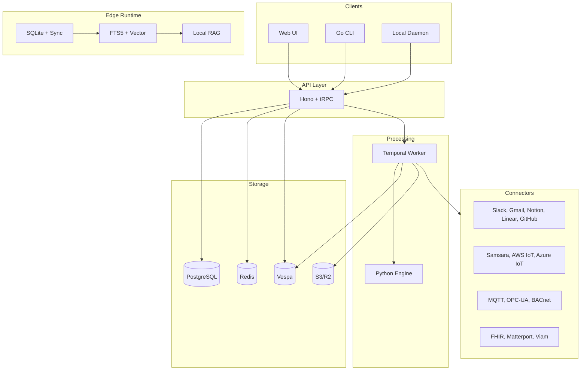
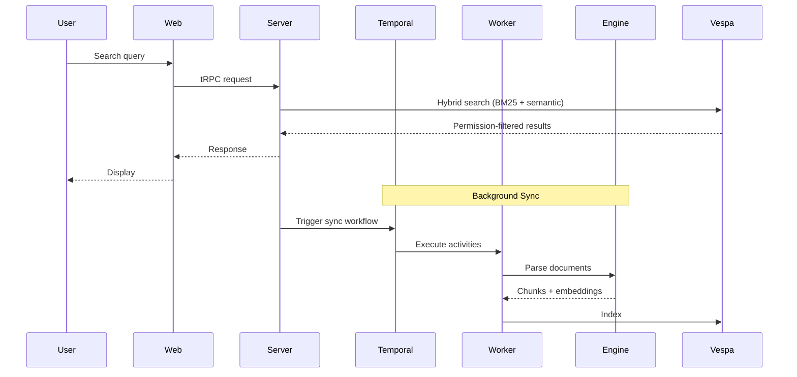

# OpenPlane

Open source enterprise search and AI assistant. Self-hosted alternative to Glean.

## Architecture



## Stack

| Layer | Technology |
|-------|------------|
| Language | TypeScript 5.8+, Zod 4 |
| Frontend | Next.js 16, React 19, TailwindCSS 4 |
| API | Hono, tRPC 11, SuperJSON |
| Workers | Temporal |
| ML Engine | FastAPI, Unstructured |
| Search | Vespa (BM25 + semantic) |
| AI | Vercel AI SDK (Claude, GPT, Gemini) |
| Database | PostgreSQL, Prisma |
| Cache/Queue | Redis |
| Storage | S3/R2 |
| CLI | Go 1.24, Cobra |
| Edge | SQLite (bun:sqlite), FTS5 |
| Linter | Biome (via Ultracite) |

## Project Structure

```
apps/
├── web         # Next.js frontend (:3001)
├── server      # Hono API + tRPC (:3000)
├── worker      # Temporal worker
├── engine      # Python ML service (:8000)
├── cli         # Go CLI (openplane command)
├── daemon      # Local headless agent daemon
├── gateway     # IoT protocol gateway
└── docs        # Documentation (:4000)

packages/
├── types       # Shared type definitions (single source of truth)
├── ai          # Agents, tools, RAG pipeline
├── api         # tRPC routers
├── auth        # Authentication
├── db          # Prisma schema, queries
├── services    # Connector business logic
├── temporal    # Workflows & activities
├── redis       # Cache & rate limiting
├── vespa       # Search client & schemas
├── media       # Video processing
├── storage     # S3/R2 client
├── integrations # OAuth configs, app definitions
├── mcp         # Model Context Protocol
├── edge-core   # Edge SQLite storage & sync
├── edge-search # Edge hybrid search (FTS5 + vector)
└── edge-ai     # Edge RAG, NER, query rewriting
```

## Data Flow



## Connectors

| Category | Connectors | Status |
|----------|-----------|--------|
| Communication | Slack | Available |
| Email | Gmail | Available |
| Storage | Google Drive | Available |
| Productivity | Notion, Linear | Available |
| Code | GitHub | Available |
| IoT | Samsara, AWS IoT, Azure IoT, SmartThings, Verkada | Available |
| Industrial | MQTT, OPC-UA, BACnet, ThingsBoard, Node-RED | Available |
| Physical AI | FHIR, Matterport, Omniverse, Viam | Available |

<Cards>
  <Card title="Getting Started" href="/docs/getting-started" description="Deploy OpenPlane in minutes" />
  <Card title="Architecture" href="/docs/architecture" description="System design and runtime flows" />
  <Card title="Connectors" href="/docs/connectors" description="Connect your tools" />
  <Card title="Self-Hosting" href="/docs/self-hosting" description="Deploy on your infrastructure" />
  <Card title="AI & Agents" href="/docs/ai" description="Search assistant and agent framework" />
  <Card title="CLI" href="/docs/cli" description="Command-line interface" />
</Cards>
