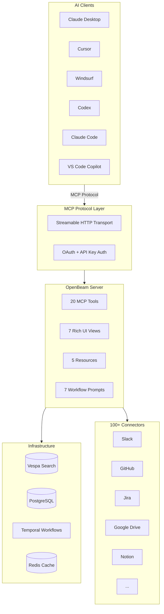

# MCP Overview

OpenBeam ships a single MCP server that gives AI assistants full access to your enterprise knowledge and tools. Instead of installing separate MCP servers for Slack, Linear, Notion, GitHub, Jira, Google Drive, and every other tool your team uses, you connect one server and get everything.

One OpenBeam MCP. 20 tools. 100+ connectors. 500+ write actions. 7 rich UI views. Every data source your team uses, accessible from any AI tool that speaks MCP.

## Why one server matters

Individual MCP servers per SaaS tool create problems:

| Problem | Individual MCPs | OpenBeam MCP |
|---------|----------------|--------------|
| Setup overhead | Configure 10+ servers, 10+ auth flows | One server, one auth |
| Cross-source search | Impossible | Unified hybrid search across all sources |
| Tool sprawl | 50+ tools for the LLM to reason about | 20 well-scoped tools |
| Permission model | Per-tool, inconsistent | Centralized scope-based access |
| Write actions | Vary wildly per server | Consistent two-tool discovery pattern |
| Rich UI | Rare | 7 interactive views in Claude Desktop |

## What you get

| Capability | Details |
|------------|---------|
| **Search** | Hybrid semantic + keyword search across all connected sources in under 200ms |
| **Connectors** | 100+ data sources -- Slack, GitHub, Jira, Confluence, Notion, Google Drive, Salesforce, and more |
| **Write actions** | 500+ actions across 89 connectors -- create issues, send messages, update records |
| **AI answers** | RAG-powered Q&A with citations grounded in your actual data |
| **Context database** | Persistent memory, hierarchical retrieval, session management |
| **Rich UI** | 7 interactive views rendered inside Claude Desktop |
| **Workflow prompts** | 7 guided workflows for common tasks |

## How it works

<Steps>
  <Step>
    **Connect your sources.** Link Slack, GitHub, Jira, Google Drive, and any other tools your team uses through the OpenBeam dashboard. OAuth handles authentication.
  </Step>
  <Step>
    **Add the MCP server.** Point your AI tool at `https://mcp.openbeam.work/mcp`. One URL, one auth token.
  </Step>
  <Step>
    **Search, ask, and act.** Your AI assistant can now search across all sources, answer questions with citations, create issues, send messages, and trigger syncs -- all through natural language.
  </Step>
</Steps>

## Architecture

## Supported clients

OpenBeam MCP works with any client that supports the MCP protocol:

| Client | Transport | Setup |
|--------|-----------|-------|
| Claude Desktop | Streamable HTTP | Native remote server support |
| Claude Code | Streamable HTTP | `claude mcp add --transport http` |
| Cursor | stdio via mcp-remote | `.cursor/mcp.json` |
| Windsurf | Streamable HTTP | Native support |
| Codex | Streamable HTTP | Native support |
| ChatGPT | Streamable HTTP | Native support |
| VS Code Copilot | stdio via mcp-remote | Settings JSON |
| Continue | stdio via mcp-remote | `config.json` |
| Cline | stdio via mcp-remote | Settings |
| OpenCode | Streamable HTTP | Config file |
| Conductor | Streamable HTTP | Native support |

See [Quickstart](/docs/mcp/quickstart) for setup instructions, or [Clients](/docs/mcp/clients) for client-specific configuration.

## Next steps

<Cards>
  <Card title="Quickstart" href="/docs/mcp/quickstart" description="Connect OpenBeam to your AI tool in under 5 minutes" />
  <Card title="Capabilities" href="/docs/mcp/capabilities" description="Full reference of tools, apps, resources, and prompts" />
  <Card title="Authentication" href="/docs/mcp/authentication" description="OAuth, API keys, and scope-based access control" />
  <Card title="Tools Reference" href="/docs/mcp/tools" description="All 20 MCP tools with parameters and examples" />
</Cards>
