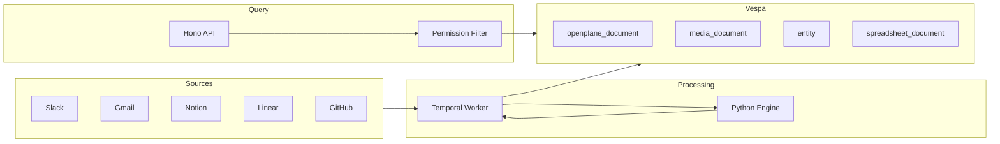

# How It Works

OpenPlane search is built on [Vespa](https://vespa.ai), an open-source serving engine designed for real-time search and ranking at scale. This page covers the indexing pipeline, query flow, ranking mechanics, and edge deployment.

## Architecture Overview



## Vespa Document Schemas

Vespa stores four document types, each with dedicated schemas:

| Schema | Purpose | Key Fields |
|--------|---------|------------|
| `openplane_document` | Text documents (messages, pages, issues, emails, files) | `content`, `content_embedding`, `title_embedding`, `sparse_embedding`, `access_control` |
| `media_document` | Video and audio with segment-level data | `transcript`, `segment_embeddings`, `segment_timestamps`, `media_keywords` |
| `entity` | People, teams, projects from knowledge graph | `name`, `email`, `entity_type`, `metadata` |
| `spreadsheet_document` | Structured tabular data | `column_names`, `column_types`, `content_summary`, `is_queryable` |

### Embedding Fields

Documents carry multiple embedding vectors for different ranking strategies:

| Field | Dimensions | Usage |
|-------|-----------|-------|
| `content_embedding` | 768 or 1024 | Primary semantic search |
| `title_embedding` | 768 or 1024 | Title-biased queries |
| `title_embedding_v2` | 1024 | Updated title embeddings |
| `sparse_embedding` | Variable (token map) | Learned sparse retrieval |
| `topic_embedding` | 768 | Topic-level similarity |
| `department_affinity` | Variable | Personalized ranking |

Sparse embeddings use a token-to-weight map format, stored as Vespa's `mapped<float>` tensor.

## Indexing Pipeline

The journey from raw data to searchable content follows this path:

### 1. Connector Fetch

Temporal workflows drive full and incremental syncs. Each connector implements an async generator that yields batches of documents:

```
connector.fullSync() → AsyncGenerator<SyncBatch>
connector.incrementalSync(cursor) → AsyncGenerator<SyncBatch>
```

### 2. Transform

Connector-specific transformers convert raw API responses into the `GenericDocument` schema. Every document gets:

- A deterministic `id` based on connector ID + external ID
- Normalized timestamps (Unix milliseconds)
- Extracted author metadata
- Access control lists from the source system

### 3. Embedding Generation

The Python engine (`apps/engine`) generates embeddings for each document:

- **Dense embeddings** via sentence-transformers or OpenAI
- **Sparse embeddings** via SPLADE or similar learned sparse models
- **Title embeddings** separately for navigational queries

Chunked documents (long pages, PDFs) are split and each chunk gets its own embedding while maintaining `parent_doc_id` references.

### 4. Vespa Feed

The `@openplane/vespa` package feeds documents to Vespa's Document API:

- Batch feeding with configurable concurrency (default: 10 parallel)
- Automatic retries on transient errors (ECONNRESET, socket errors)
- Exponential backoff (2^attempt seconds, max 3 retries)
- Async feed mode for large-volume imports

```
POST /document/v1/default/openplane_document/docid/{id}
```

Metadata objects are JSON-stringified before feeding (Vespa stores them as `string` fields).

## Query Flow

### 1. User Request

A search request arrives via the tRPC API or CLI:

```typescript
{
  query: "Q3 revenue report",
  teamId: "team_abc",
  connectorTypes: ["notion", "google-drive"],
  limit: 20,
  rankingProfile: "hybrid"
}
```

### 2. YQL Construction

The query builder generates Vespa's YQL (Yahoo Query Language):

```sql
SELECT * FROM openplane_document
WHERE team_id CONTAINS "team_abc"
  AND (connector_type CONTAINS "notion" OR connector_type CONTAINS "google-drive")
  AND (title CONTAINS "Q3 revenue report" OR content CONTAINS "Q3 revenue report")
```

### 3. Permission Filtering

Access control IDs for the requesting user are injected into the query:

```sql
AND (is_public = true
  OR access_control CONTAINS "user_123"
  OR access_control CONTAINS "group_engineering")
```

This filter evaluates at the Vespa content node level, before ranking, so unauthorized documents never enter the result set.

### 4. Ranking

Vespa applies the selected ranking profile. For `hybrid`, the flow is:

1. **First phase**: BM25 scoring on `title` and `content` fields with `title` boosted 2x
2. **Second phase**: Dense vector cosine similarity between query embedding and `content_embedding`
3. **Fusion**: Reciprocal Rank Fusion combines BM25 rank and vector rank with configurable weights

For `hybrid_v2`, sparse vector matching is added as a third signal.

### 5. Response

The Vespa response includes coverage metadata used for query health monitoring:

```typescript
{
  root: {
    fields: { totalCount: 142 },
    coverage: {
      full: true,
      degraded: { "match-phase": false, timeout: false }
    },
    children: [
      { id: "doc_1", relevance: 0.89, fields: { ... } },
      { id: "doc_2", relevance: 0.84, fields: { ... } }
    ]
  }
}
```

The client transforms this into a `RankedSearchResult` with pagination metadata (current page, total pages, next/previous offsets).

## Ranking Deep Dive

### BM25

Classic probabilistic ranking. Vespa computes per-field BM25 scores with default parameters k1=1.2, b=0.75. The title field carries a higher weight than content for navigational queries.

### Dense Vector Similarity

Cosine similarity between the query embedding and document embeddings. Vespa uses HNSW (Hierarchical Navigable Small World) indexing for approximate nearest neighbor search, giving sub-linear query time even with millions of documents.

### Sparse Vector Matching

Dot product between the query's learned sparse representation and the document's sparse embedding. Sparse vectors capture fine-grained term importance beyond raw frequency. The embedding is stored as a `mapped<float>` tensor in Vespa: `{token: weight, ...}`.

### Reciprocal Rank Fusion (RRF)

RRF combines ranked lists from multiple retrieval methods without requiring score calibration:

```
RRF_score(d) = sum( 1 / (k + rank_i(d)) )
```

Where `k` is a constant (default 60) and `rank_i(d)` is the rank of document `d` in the i-th ranking. Higher `k` reduces the impact of top-ranked outliers.

### Authority and Engagement Signals

For `enterprise` ranking profiles, additional signals are layered:

| Signal | Source |
|--------|--------|
| `authority_score` | Computed from inbound links, canonical status, source tier |
| `quality_score` | Content quality heuristics (length, structure, freshness) |
| `trending_score` | Recent access frequency |
| `view_count` | Cumulative views |
| `reaction_count` | Likes, upvotes, emoji reactions |
| `inbound_links_count` | Cross-references from other documents |

## Performance

### Targets

| Metric | Target |
|--------|--------|
| Search p50 | < 50ms |
| Search p99 | < 200ms |
| Embedding generation | < 100ms per document |
| Feed throughput | 100+ documents/second |

### Connection Pooling

The Vespa client uses undici connection pooling (10 connections, keep-alive 30s) to minimize TCP overhead. Vector queries use POST (body contains embedding tensors), while simple keyword queries use GET with query parameters.

### Caching

An optional LRU cache (max 1000 entries, 30s TTL) sits in front of the Vespa client. Cache keys are derived from YQL, ranking profile, pagination, and a hash prefix of the query embedding. Cache is disabled by default and intended for read-heavy workloads with stable queries.

### Query Timeout

Default timeout is 5 seconds. Vespa returns partial results with `coverage.degraded.timeout = true` if the timeout fires before full evaluation. The client reports this in `QueryMetrics`.

## Edge Search Architecture

The edge runtime (`@openplane/edge-search`) provides offline search using SQLite:

### FTS5 (Full-Text Search)

SQLite's FTS5 extension provides BM25 keyword search:

- Tokenized `title` and `content` fields
- BM25 ranking with the same conceptual model as Vespa
- Prefix queries and phrase matching supported

### Vector Search

Embedding vectors stored as BLOBs in SQLite. Cosine similarity computed in application code:

- Linear scan for small datasets (< 10K documents)
- Partitioned scan by connector type for larger sets
- Quantized embeddings (float16) to reduce storage

### Hybrid Fusion

RRF combines FTS5 BM25 scores and vector similarity scores, mirroring the cloud search behavior so users get consistent results regardless of connectivity.

### Sync

Documents replicate from the cloud index to edge via Merkle tree reconciliation:

1. Server and edge compute Merkle roots over document checksums
2. Tree comparison identifies divergent subtrees
3. Only changed documents transfer over the sync channel
4. Incremental sync runs periodically; full reconciliation on first connect

## Multi-Ranking Strategy

The `searchWithMultipleRankings` function executes the same query against multiple ranking profiles in parallel:

```typescript
const result = await searchWithMultipleRankings({
  query: "deployment process",
  teamId: "team_abc",
  strategies: ["keyword", "semantic", "hybrid", "authority"],
  embeddings: { query: queryEmbedding },
});

// result.bestStrategy = "hybrid"
// result.aggregatedHits = deduplicated, best-score-wins merge
```

This powers the ranking profile selector in the UI and provides data for A/B testing search quality.

## Monitoring

The Vespa client emits structured metrics for every query:

| Metric | Description |
|--------|-------------|
| `vespa.query.latency_ms` | End-to-end query time |
| `vespa.query.degraded` | Whether results are partial |
| `vespa.query.error` | Query errors |
| `vespa.feed.latency_ms` | Document feed time |
| `vespa.feed.error` | Feed errors |
| `vespa.cache.hit` / `vespa.cache.miss` | Cache hit ratio |

Query metrics include coverage (full/partial), match phase degradation, and result count. These feed into Prometheus for alerting on search quality degradation.
